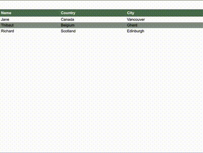

# Remark Table Data Label

[Remark](https://github.com/remarkjs/remark) plugin to take table header values and add them as data-labels within a data cell. This allows for tables to be consumed in mobile browsers. 



Input Markdown

```md
| Name    | Country  | City      |
|---------|----------|-----------|
| Jane    | Canada   | Vancouver |
| Thibaut | Belgium  | Ghent     |
| Richard | Scotland | Edinburgh |
```

Resulting HTML

```html
<table>
    <thead>
        <tr>
            <th>Name</th>
            <th>Country</th>
            <th>City</th>
        </tr>
    </thead>
    <tbody>
        <tr>
            <td data-label="Name">Jane</td>
            <td data-label="Country">Canada</td>
            <td data-label="City">Vancouver</td>
        </tr>
        <tr>
            <td data-label="Name">Thibaut</td>
            <td data-label="Country">Belgium</td>
            <td data-label="City">Ghent</td>
        </tr>
        <tr>
            <td data-label="Name">Richard</td>
            <td data-label="Country">Scotland</td>
            <td data-label="City">Edinburgh</td>
        </tr>
    </tbody>
</table>
```

## Examples

Example directory includes sample markdown files, example.js script which steps through the remark/ rehype conversion process, and an html table that resizes properly on small viewports.